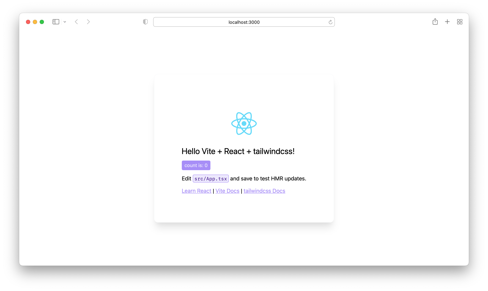
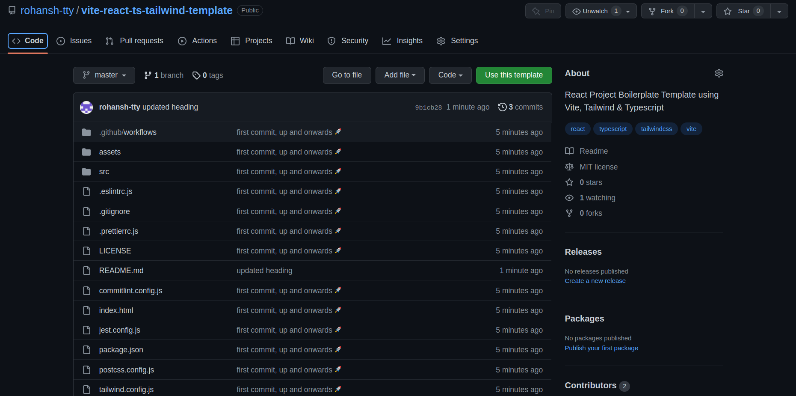

# vite React TypeScript tailwindcss starter

Template for vite, React + tailwindcss + TypeScript projects with some tools preconfigured.

## About

Template for vite, React + tailwindcss + TypeScript projects with some tools preconfigured.

### Libraries

- [React](https://reactjs.org/)
- [tailwindcss](https://tailwindcss.com/)
  - [tailwindcss forms plugin](https://tailwindcss-forms.vercel.app/)
- [TypeScript](https://www.typescriptlang.org/)
- [vite](https://vitejs.dev/)

## Usage

Create a new project from this template by clicking the "Use this template" button:

